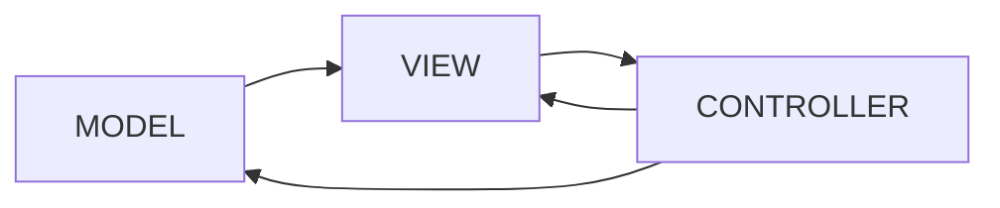

# Architecture globale
>L’architecture de notre système est formée :
>D'une IHM faite en Angular permettant à l’utilisateur de consulter la liste des vols, réserver des billets et de voir ses réservations. 
>Une API en SpringBoot permetant d'interagir avec les données.
>nous avons opté pour un modèle MVC 

# Modèle de données

Afin de développer l'API, nous avons décidé d'utiliser l'environement SpringBoot. 
SpringBoot est un framework open source pour construire et définir l'infrastructure d'une application Java.

# Stack technique

