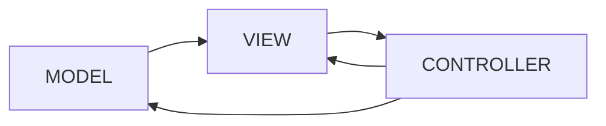

# Architecture globale
>L’architecture de notre système est formée :
>D'une IHM faite en Angular permettant à l’utilisateur de consulter la liste des vols, réserver des billets et de voir ses réservations. 
>Une API en SpringBoot permetant d'interagir avec les données.
>nous avons opté pour un modèle MVC 

 

# Modèle de données

Afin de développer l'API, nous avons décidé d'utiliser l'environement SpringBoot. 
SpringBoot est un framework open source pour construire et définir l'infrastructure d'une application Java.

 

# Stack technique
### Applications et data

 - JavaScript
 - Java
 - Angular
 - SpringBoot
 
 
Nous avons décidé d'utiliser différents frameworks et langages entre le front-end et le back-end.
Pour l'affichage utilisateur (le front-end), nous utilisersons le JavaScript, le langage HTML et le framework Angular.
En ce qui concerne le back-end, nous utiliserons le langage Java et le framework Spring ainsi que l'utilisation de JPA pour ourganiser des données relationnelles de manière persistante pour retrouver un fonctionnement similaire à une base de données.
Le framework Spring nous permet très simplement de créer des applications en tout genre. Dans notre cas, nous allons utiliser ce framework afin de créer quelques API qui seront appelées par le front. Ce framework permet aussi de gérer la connexion à des bases de données pour y stocker des données.
