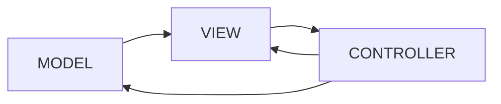
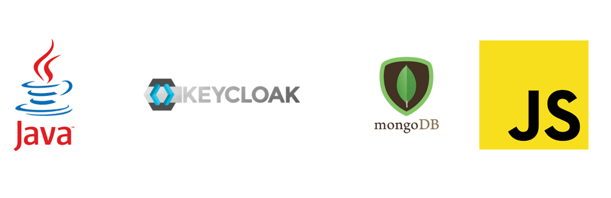

# Architecture globale

> nous avons opte pour un modele MVC

```mermaid
graph LR;
    A[MODEL] --> B[VIEW]
    C[CONTROLLER] --> A[MODEL]
    C[CONTROLLER] --> B[VIEW]
    B[VIEW] --> C[CONTROLLER]    
```

# Modele de donee

# Stack technique

rajouter Angular