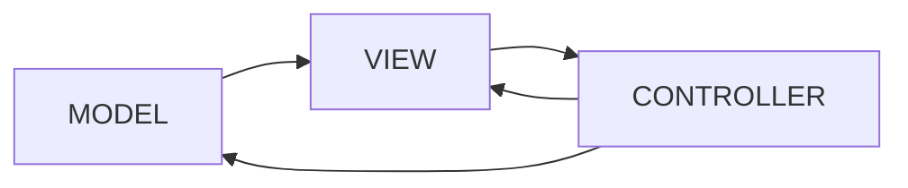
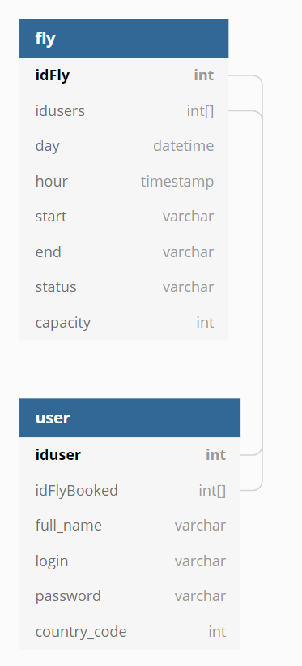
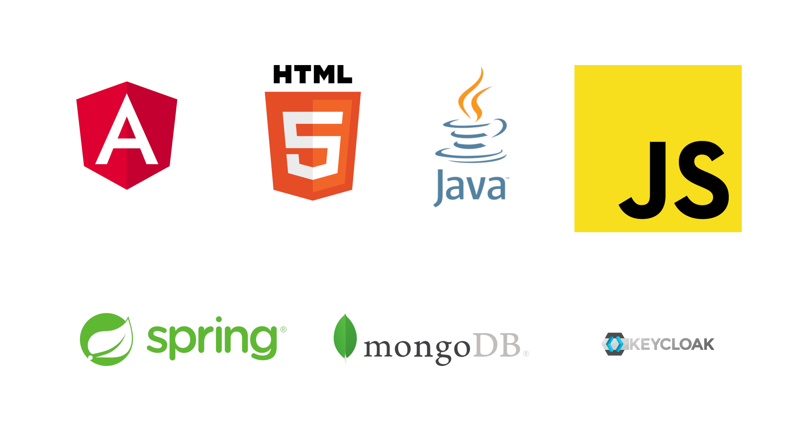

# Architecture globale

Nous avons opté pour une architecture de type MVC : 
- Modèle
- Vue
- Contôleur

La vue interagit avec le contrôleur et ne fait qu'afficher le modèle. C'est le contrôleur qui ira faire les principales actions sur la vue et sur le modèle. Cela permet d'avoir un code un peu plus propre et d'avoir une certaine flexibilité et permettre à ces différents blocs d'évoluer sans grande difficulté. Voici un petit schéma permettant de comprendre :

# Modèle de données
Nous stockons nos données de cette manière :

Nous allons utiliser le langage JSON afin de stocker ces données, c'est un format pensé pour le web et qui sera utilisé par nos frameworks. De plus, c'est un format traduisible en Java, cela nous aidera grandement pour l'implémentation de nos idées. 

# Stack technique

Nous avons décidé d'utiliser différents frameworks et langages entre le front-end et le back-end. 
Pour l'affichage utilisateur (le front-end), nous utilisersons le JavaScript, le langage HTML et le framework Angular.
En ce qui concerne le back-end, nous utiliserons le langage Java et le framework Spring ainsi que l'utilisation de mongoDB pour avoir une base de données.
Le framework Spring nous permet très simplement de créer des applications en tout genre. Dans notre cas, nous allons utiliser ce framework afin de créer quelques API qui seront appelées par le front. Ce framework permet aussi de gérer la connexion à des bases de données pour y stocker des données.